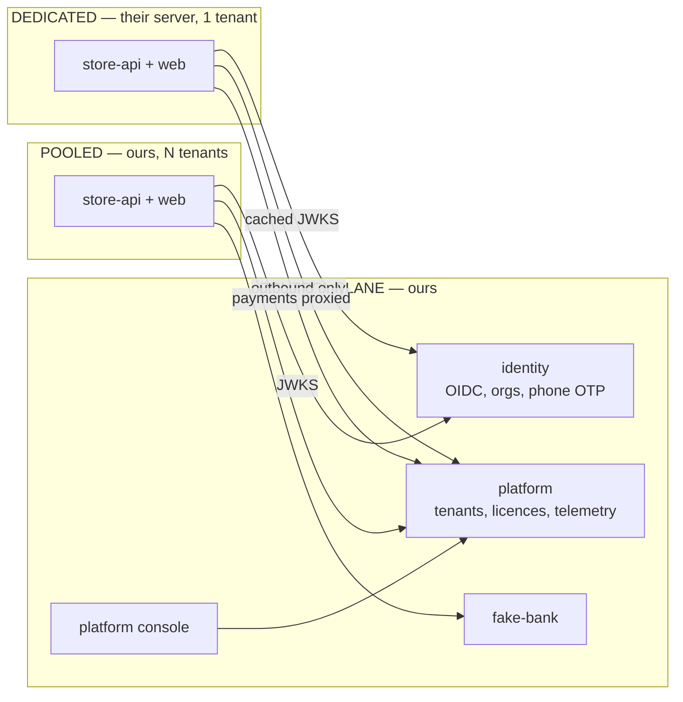

# mercatus

A **multi-tenant commerce platform** — merchants buy a store, list products, and sell. Think a
marketplace of independent shops: most run on our shared infrastructure, some run on the
merchant's own server, and everyone signs in through one identity service.

This is a **proof of concept for a showcase**. It runs entirely on one machine, with no external
accounts, no cloud, and no CI. Nothing here is production code yet.

---

## What it demonstrates

Five things, in order of how much they matter to the demo:

1. **Tenant isolation that isn't a `WHERE` clause.** Postgres RLS, tenant taken from the token.
2. **One image, two deployment modes.** The same store runs pooled (N tenants) or dedicated
   (1 tenant, on someone else's server). No forked edition.
3. **Centralised identity across both.** A store on a customer's VPS still authenticates against
   ours, verifying tokens offline via cached JWKS.
4. **Graceful degradation.** Kill the control plane and a dedicated store keeps selling, then
   catches up when it returns.
5. **Failure injection for payments.** A `fake-bank` we control, told what to answer.

Number 4 is the demo. The rest is table stakes.

---

## Scope

### In

| | |
|---|---|
| Sign in with phone + OTP | via the identity container |
| Buy a store | checkout through `fake-bank`, tenant activated on callback |
| Merchant dashboard | create a store, add products, see orders |
| Storefront | browse, add to basket, order |
| Two pooled tenants | seeded, isolated, with a leak test suite proving it |
| One dedicated instance | same image, own database, "customer's VPS" |
| Platform console | operator view across both planes |
| Unified telemetry | every service, both planes, one dashboard |

### Out — deliberately

| Dropped | Why |
|---|---|
| **Anything domain-specific** | No pharmacy, no drug data, no prescriptions, no regulatory logic. Generic products, generic orders |
| **Excel / spreadsheet export** | Not needed to prove anything |
| **QR codes** | Same |
| **CI / GitHub Actions** | Everything runs locally for now. Tests exist and are run by hand |
| **Real payment provider** | `fake-bank` is better for a demo — it can fail on purpose |
| **Invoicing and tax** | Orders have numbers; they are not invoices |
| **Custom domains and certificates** | Tier 2 is designed for, not built |
| **Per-tenant SSO federation** | Later, if ever |
| **Search, recommendations, mobile** | Not the point |
| **Deployment** | No Coolify, no Traefik in production, no cloud. Local only |

**DE.** On CI specifically: skipping it is a POC decision, not a judgement. The tooling is chosen
so that adding a workflow later is a dozen lines — `turbo run typecheck lint test`, and the tests
are written to run unattended from day one. But nothing is wired to a runner while the only
consumer is a laptop.

---

## The shape



A **tenant** is a store. A **user** is a person, who may belong to several stores. A **shopper** is
a row in a store's own database, never in the identity service. Three concepts, kept separate on
purpose — see [`docs/dos-and-donts.md`](./docs/dos-and-donts.md) `CD3`, `BA1`.

Three tiers exist in the design; the POC builds tier 1 and tier 3, because those are the two that
differ architecturally:

| Tier | Address | Data | In the POC |
|---|---|---|---|
| 1 — pooled, path | `platform.localtest.me/shop/acme` | shared DB, RLS | ✅ |
| 2 — pooled, custom domain | `acme.com` → our edge | shared DB, RLS | designed, not built |
| 3 — dedicated | `acme.localtest.me`, their server | own DB, one tenant | ✅ |

---

## Stack

| Layer | Choice | Note |
|---|---|---|
| Runtime | **Node LTS**, TypeScript strict, ESM | |
| Monorepo | **pnpm workspaces** + **Turborepo** | versions pinned once via pnpm `catalog:` |
| Orchestration | **.NET Aspire** AppHost | polyglot — it orchestrates Node processes and containers alike |
| HTTP | **Fastify** | a small shared composition helper in `packages/core`, not a framework on a framework |
| Validation | **Zod** | one schema per DTO |
| Contract | **OpenAPI**, generated from Zod | `fastify-type-provider-zod` + `@fastify/swagger` |
| API docs | **Scalar** | `@scalar/fastify-api-reference` |
| Clients | **Orval** / Kubb | generated TS client + TanStack Query hooks. No hand-written request layer |
| Database | **PostgreSQL** + **Drizzle** | RLS policies live in the schema |
| Migrations | **drizzle-kit** | run as an init step, never in-process |
| Identity | **Logto** container | organizations = tenants, `organization_id` in the JWT, HTTP SMS connector for OTP |
| Scheduled work | **none** | state derived from timestamps; add pg-boss only for real side effects |
| Realtime | **SSE** | one direction, server to client |
| Dashboard / console | **TanStack Start** + **Fluent UI v9** | type-safe search params matter for filter-heavy screens |
| Tables | **TanStack Table** | headless |
| Charts | **Chart.js** | |
| Storefront | **Next.js** | content-shaped, ISR for catalog pages |
| Logging | **pino** → OTLP | |
| Tracing / metrics | **@opentelemetry/sdk-node** | reads Aspire's env vars with zero config |
| Errors | **@sentry/node** | GlitchTip-compatible |
| Tokens | **jose** | verification only — the IdP mints them |
| Rate limiting | **rate-limiter-flexible** | Postgres store, per-tenant keys |
| Conventions | **ESLint** (`--max-warnings 0`) + **ts-morph** | enforced by the build, not by review |
| Tests | **Vitest**, **Testcontainers**, **Playwright** | run locally |
| Payments | **fake-bank** | ours, run-mode only |

**DF.** Two of those are worth calling out as reversals from earlier thinking. **Identity is bought,
not built** — once a server we don't control has to verify our tokens, hand-rolling an IdP means
owning OIDC discovery, JWKS rotation and revocation, and Logto's organizations already model
tenants the way we need. And **there is no job queue at all** — the only scheduling the domain
needs is "is this campaign live right now", which is a predicate, not a job.

---

## Layout

```
apps/
  platform       # Fastify — control plane: tenants, licences, telemetry ingest
  store          # Fastify — data plane API. One image, DEPLOYMENT_MODE=pooled|dedicated
  dashboard      # TanStack Start — merchant dashboard
  admin          # TanStack Start — platform console
  storefront     # Next.js
  fake-bank      # Fastify — run-mode only, never published
packages/
  core           # errors, pagination, tenant context, telemetry wiring
  contracts      # Zod schemas
  db-platform    # Drizzle schema + migrations
  db-store       #   "
  clients        # generated from OpenAPI
aspire/
  AppHost        # C# — the topology, and the trust-boundary document
```

There is no `apps/identity`: identity is a container we configure. `aspire/AppHost` stays C#
because it is config nobody edits daily, and because the application model is where the
control-plane / data-plane trust boundary can be asserted in a test.

---

## Running it

```bash
cd aspire/AppHost
aspire run --detach
```

Starts the control plane, a pooled store seeded with two tenants, and the supporting containers.
The dedicated instance and its database are marked `WithExplicitStart()` — start them from the
dashboard when you want to demo tier 3, so the everyday loop stays light.

Local hostnames use `*.localtest.me`, which resolves to `127.0.0.1` without touching `/etc/hosts`:

| | |
|---|---|
| `platform.localtest.me/shop/acme` | tier 1 storefront |
| `acme.localtest.me` | tier 3 storefront, "their server" |
| the Aspire dashboard | traces, logs and per-resource start/stop |

To demo degradation: stop `platform` in the Aspire dashboard and keep ordering on
`acme.localtest.me`.

---

## Docs

| | |
|---|---|
| [`docs/architecture.md`](./docs/architecture.md) | Service graphs — context, topology, tiers, token flow, buy-a-store, provisioning, degradation, data model, what `aspire run` starts |
| [`docs/dos-and-donts.md`](./docs/dos-and-donts.md) | 32 rules with the failure behind each one. Start here before writing code |
| [`docs/port-analysis.md`](./docs/port-analysis.md) | Archived. How this started — analysing a .NET rewrite. Kept for its stack reasoning and stable labels |

---

## Influences

Shaped by a production .NET system (`Mercury`) and by reading two prior-art repos.

**Kept:**

- **`fake-bank`** — a configurable, failure-injecting stand-in for an external dependency, gated
  to run-mode so it can never ship. The best idea in the source system.
- **Build-enforced conventions** — banned-symbol analysers became ESLint rules; a Roslyn
  architecture test became ts-morph.
- **Rationale in the code**, with the issue number. The reason its hard-won rules survived long
  enough to be written down.
- **Retirement by tag**, not by leaving dead folders.
- **Fresh dev containers per run** — a persistent container is shared by every checkout on the
  machine.

**Deliberately not kept:**

- An external system's identifier as a primary key. Seen twice now — `jti` as a user id in the
  source system, and a Stripe subscription id as a tenant id in a course repo, where it ends up in
  table names, role names and group names.
- Hand-written API request layers. Generated from OpenAPI instead.
- A realtime hub used as service-to-service RPC.
- Global unique constraints.
- One admin app with a staff flag.

---

## Open questions

**Q16.** For a dedicated instance, who operates the server — we install and maintain it, or they
do and we support only the software? The biggest cost question in that tier.

**Q14.** Where do a dedicated tenant's staff sign in — our identity domain with their branding, or
theirs via federation?

**Q11.** Do tenants ever need their own domain? Decides whether tier 2 gets built.

Answered: **Q5** (standalone — no surviving consumers of the old system), **Q8** (the remaining
boundary is control plane vs data plane, a deployment boundary rather than a service split),
**Q9** (a tenant is a store), **Q13** (signup creates the tenant, payment activates it),
**Q15** (no shared product master — every catalog is seller-owned), **Q17** (the dashboard ships
with the instance — see below), **Q19** (renamed to `mercatus`, and moved out of the Alternet
project tree).

**DK.** On **Q17**, the simple option and the correct one are the same one, which is lucky. The
dashboard **ships with the instance**: it is the same app deployed twice with a different
`STORE_API`, which is one environment variable and no new code — the same treatment the API gets
under `CC1`. The central alternative sounds simpler but isn't: it would need per-tenant API
resolution at runtime, CORS on every dedicated instance, and the browser reaching their server
directly. It would also gut the flagship demo, because a merchant who cannot open their dashboard
while our control plane is down is not a merchant whose shop kept working. The diagrams in
[`docs/architecture.md`](./docs/architecture.md) already assume this; no change needed.
