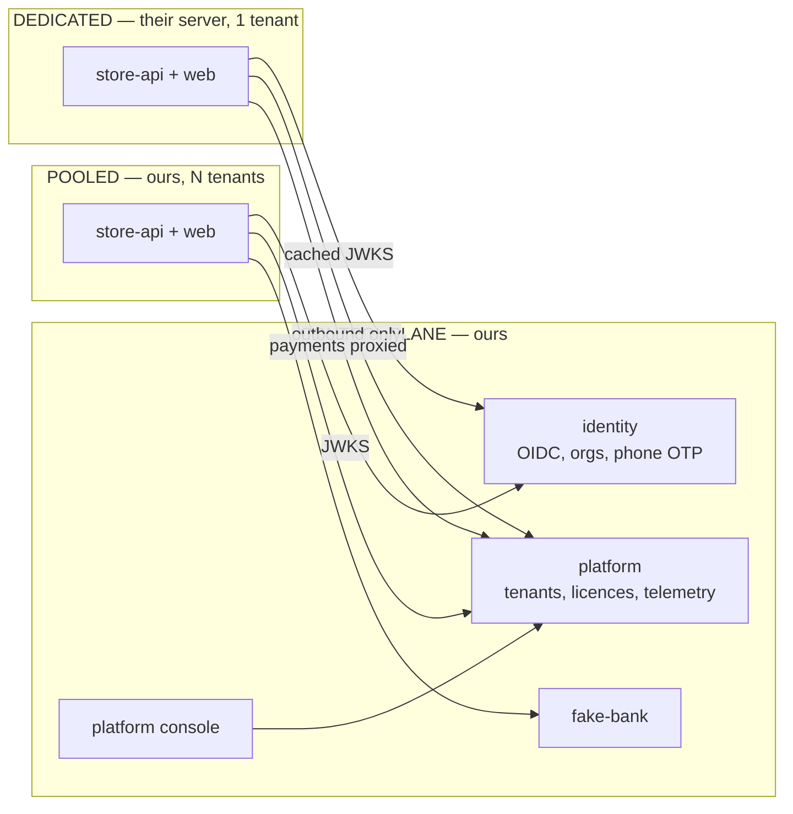

# mercatus

A **multi-tenant commerce platform** — merchants buy a store, list products, and sell. Think a
marketplace of independent shops: most run on our shared infrastructure, some run on the
merchant's own server, and everyone signs in through one identity service.

This is a **learning project** — a proof of concept, built small on purpose. It runs entirely on
one machine, with no external accounts, no cloud and no CI. The goal is to get the interesting
parts right, not to be complete: multi-tenancy, a shared identity service, and a store that runs
on someone else's server and keeps working when ours is down.

---

## What it demonstrates

Five things, in order of how much they matter to the demo:

1. **Tenant isolation that isn't a `WHERE` clause.** Postgres RLS, tenant taken from the token.
2. **One image, two deployment modes.** The same store runs pooled (N tenants) or dedicated
   (1 tenant, on someone else's server). No forked edition.
3. **Centralised identity across both.** A store on a customer's VPS still authenticates against
   ours, verifying tokens offline via cached JWKS.
4. **Graceful degradation.** Kill the control plane and a dedicated store keeps selling, then
   catches up when it returns.
5. **Failure injection for payments.** A `fake-bank` we control, told what to answer.

Number 4 is the demo. The rest is table stakes.

---

## Scope

### In

| | |
|---|---|
| Sign in with phone + OTP | via the identity container |
| Buy a store | checkout through `fake-bank`, tenant activated on callback |
| Merchant dashboard | add products, see orders |
| Storefront | browse, basket, checkout — happy path only |
| Two pooled tenants | seeded, isolated, with a leak test suite proving it |
| One dedicated instance | same image, own database, "customer's VPS" |
| Platform console | operator view across both planes |
| Unified telemetry | every service, both planes, one dashboard |

### Out — deliberately

| Dropped | Why |
|---|---|
| **Anything domain-specific** | No pharmacy, no drug data, no prescriptions, no regulatory logic. Generic products, generic orders |
| **Excel / spreadsheet export** | Not needed to prove anything |
| **QR codes** | Same |
| **CI / GitHub Actions** | Everything runs locally for now. Tests exist and are run by hand |
| **Real payment provider** | `fake-bank` is better for a demo — it can fail on purpose |
| **Invoicing and tax** | Orders have numbers; they are not invoices |
| **Discounts, categories, campaigns** | Products have a price. That's it |
| **Shipping, returns, refunds** | Checkout ends at "ordered" |
| **Variants** | Looks small, isn't |
| **Visual polish** | Consistent and plain beats pretty. One component set, no theming work |
| **Custom domains and certificates** | Tier 2 is designed for, not built |
| **Per-tenant SSO federation** | Later, if ever |
| **Search, recommendations, mobile** | Not the point |
| **Deployment** | No Coolify, no Traefik in production, no cloud. Local only |

**DE.** On CI specifically: skipping it is a POC decision, not a judgement. The tooling is chosen
so that adding a workflow later is a dozen lines — `turbo run typecheck lint test`, and the tests
are written to run unattended from day one. But nothing is wired to a runner while the only
consumer is a laptop.

---

## The shape



A **tenant** is a store. A **user** is a person, who may belong to several stores. A **shopper** is
a row in a store's own database, never in the identity service. Three concepts, kept separate on
purpose — see [`docs/dos-and-donts.md`](./docs/dos-and-donts.md) `CD3`, `BA1`.

Three tiers exist in the design; the POC builds tier 1 and tier 3, because those are the two that
differ architecturally:

| Tier | Address | Data | In the POC |
|---|---|---|---|
| 1 — pooled, path | `shop.localtest.me:28080/t/acme` | shared DB, RLS | ✅ |
| 2 — pooled, custom domain | `acme.com` → our edge | shared DB, RLS | designed, not built |
| 3 — dedicated | `acme.localtest.me`, their server | own DB, one tenant | ✅ |

---

## Stack

| Layer | Choice | Note |
|---|---|---|
| Runtime | **Node LTS**, TypeScript strict, ESM | |
| Monorepo | **pnpm workspaces** + **Turborepo** | versions pinned once via pnpm `catalog:` |
| Orchestration | **.NET Aspire** AppHost | polyglot — it orchestrates Node processes and containers alike |
| HTTP | **Fastify** | a small shared composition helper in `packages/core`, not a framework on a framework |
| Validation | **Zod** | one schema per DTO |
| Contract | **OpenAPI**, generated from Zod | `fastify-type-provider-zod` + `@fastify/swagger` |
| API docs | **Scalar** | `@scalar/fastify-api-reference` |
| Clients | **Orval** / Kubb | generated TS client + TanStack Query hooks. No hand-written request layer |
| Database | **PostgreSQL** + **Drizzle** | RLS policies live in the schema |
| Migrations | **drizzle-kit** | run as an init step, never in-process |
| Identity | **Logto** container | organizations = tenants, `organization_id` in the JWT, HTTP SMS connector for OTP |
| Scheduled work | **none** | state derived from timestamps; add pg-boss only for real side effects |
| Realtime | **SSE** | one direction, server to client |
| Dashboard / console | **TanStack Start** + **Fluent UI v9** | type-safe search params matter for filter-heavy screens |
| Tables | **TanStack Table** | headless |
| Charts | **Chart.js** | |
| Storefront | **Next.js** | content-shaped, ISR for catalog pages |
| Logging | **pino** → OTLP | |
| Tracing / metrics | **@opentelemetry/sdk-node** | reads Aspire's env vars with zero config |
| Errors | **@sentry/node** | GlitchTip-compatible |
| Tokens | **jose** | verification only — the IdP mints them |
| Rate limiting | **rate-limiter-flexible** | Postgres store, per-tenant keys |
| Conventions | **ESLint** (`--max-warnings 0`) + **ts-morph** | enforced by the build, not by review |
| Tests | **Vitest**, **Testcontainers**, **Playwright** | run locally |
| Payments | **fake-bank** | ours, run-mode only |

**FI.** Three rows of that table are **not** what was built, and the code is right rather than the
table. The dashboard and the console are **Vite + React + TanStack Router SPAs**, not TanStack
Start. The UI is **plain CSS with design tokens** from `packages/ui`, not Fluent UI v9. And there
is **no generated client**: `packages/clients` was never built, each app has a ~40-line typed fetch
wrapper that parses with the Zod contracts, and OpenAPI generation stops at the Scalar docs page.
The table is left as written because it is the design conversation's record;
`docs/decisions-made-overnight.md` (task 00) has the reasons.

**DF.** Two of those are worth calling out as reversals from earlier thinking. **Identity is bought,
not built** — once a server we don't control has to verify our tokens, hand-rolling an IdP means
owning OIDC discovery, JWKS rotation and revocation, and Logto's organizations already model
tenants the way we need. And **there is no job queue at all** — the only scheduling the domain
needs is "is this campaign live right now", which is a predicate, not a job.

---

## Layout

```
apps/
  platform       # Fastify — control plane: tenants, licences, telemetry ingest
  store          # Fastify — data plane API. One image, DEPLOYMENT_MODE=pooled|dedicated
  dashboard      # Vite + React + TanStack Router — merchant dashboard (SPA)
  admin          # Vite + React + TanStack Router — platform console (SPA)
  storefront     # Next.js
  fake-bank      # Fastify — run-mode only, never published
packages/
  core           # errors, pagination, tenant context, createServer, telemetry wiring
  contracts      # Zod schemas
  db-platform    # Drizzle schema + migrations
  db-store       #   "
  ui             # tokens.css + reset.css. Stylesheets only, no React components
  identity       # Logto bootstrap and the OIDC login round-trip gate
  e2e            # Playwright — the three stories, driven in real Chrome
aspire/
  AppHostA       # C# — ours: control plane, identity, bank, pooled plane, the edge
  AppHostB       # C# — "their server": one tenant, own database, outbound only
```

There is no `apps/identity`: identity is a container we configure, and `packages/identity` is only
the code that bootstraps it. The AppHosts stay C# because they are config nobody edits daily, and
because the application model is where the control-plane / data-plane trust boundary is asserted —
AppHost B *cannot* reference A's databases, since they are not in its model.

---

## Running it

**Two AppHosts, two commands.** AppHost A is everything we run; AppHost B is one customer's
server. `aspire run` is always `--detach`, and each is stopped from its own directory.

```bash
# A -- control plane, identity, fake-bank, the pooled store, the edge on 8080
cd aspire/AppHostA && aspire run --detach --non-interactive --nologo --format Json

# B -- "Zenith's VPS": its own Postgres, the same store image, DEPLOYMENT_MODE=dedicated
cd aspire/AppHostB && aspire run --detach --non-interactive --nologo --format Json

# and back down, each from its own directory
cd aspire/AppHostA && aspire stop --non-interactive --nologo
cd aspire/AppHostB && aspire stop --non-interactive --nologo
```

Each directory holds an `aspire.config.json` naming its own `apphost.cs`, which is how the CLI
knows which application is meant; from anywhere else, `aspire run --apphost aspire/AppHostB`
says it explicitly. The two dashboards are on **15230** (A) and **15240** (B), each printing a
one-time login token on start — B's OTLP and resource-service ports are moved in its
`apphost.run.json`, or the two collide.

B needs A running when it starts: it presents a one-time bootstrap token to
`POST /installations/register`, is given a per-instance credential (`CE1`) which it writes to
`.instance/zenith.json`, and polls with that from then on. B's application model contains no
control-plane database — it reaches A only through `AddExternalService`, over
`platform.localtest.me:28080` and `bank.localtest.me:28080`. `*.localtest.me` resolves to
`127.0.0.1` without touching `/etc/hosts`.

**`aspire stop` on A destroys A's database with it**, so a rebuilt control plane has never heard
of that installation. B's install command therefore *checks* its credential on every start and
re-registers when the control plane refuses it — the dev bootstrap token is re-seeded unspent on
every fresh platform database, so `aspire stop && aspire run` on B is the whole recovery and
nothing has to be edited or deleted by hand. (Until this was fixed the box kept polling with a
dead token, got 401 for ever, and reported itself healthy the whole time.) The catch is that this
check runs **only at B's start** — a B that is already running when A is rebuilt never recovers;
see **The demo** below. An unreachable control plane is *not* a refusal: B keeps
its credential and boots anyway (`CG1`).

**Every page of A's is served on one port**, 28080, through the edge — one hostname per surface,
all of them `*.localtest.me`, which resolves to loopback with no `/etc/hosts` entry:

| Through the edge, port 28080 | |
|---|---|
| `shop.localtest.me/t/acme`, `/t/borg` | tier 1 storefronts, pooled |
| `dash.localtest.me` | merchant dashboard, pooled |
| `console.localtest.me` | platform console |
| `platform.localtest.me` | the control plane API |
| `bank.localtest.me` | fake-bank |
| `api.localtest.me`, and anything unmatched | the pooled store API |

**Be honest about how far that goes: it is true of the HTML, and not of everything the page then
does.** Two known leaks off the edge, both fine on a laptop and both wrong the moment only the edge
port is exposed:

- **Checkout leaves the edge.** fake-bank builds its hosted payment URL from the request it
  received, and the storefront calls it at its direct `FAKE_BANK_URL` — so a shopper who bought at
  `shop.localtest.me:28080` is sent straight to fake-bank's own port to pay. The
  `bank.localtest.me` route exists; this flow does not use it.
- **The two SPAs are served through the edge and call the APIs direct**, at `VITE_STORE_API_URL`
  and `VITE_PLATFORM_URL` (both set in `aspire/AppHostA/apphost.cs`). Nothing complains, because
  CORS is `origin: true` on every service — see `packages/core/src/http/server.ts`.

Pointing those three variables at the edge hostnames, and then narrowing CORS to them, is one
change and is the first item in [`docs/MORNING.md`](./docs/MORNING.md) §6.

**The direct ports are still there, and are what the e2e suite drives — but they are no longer
numbers anyone can write down.** Every one of them is assigned by Aspire at run time, so the table
that used to sit here would be wrong on the first run. Each AppHost writes its own half of the
address book as it comes up:

```bash
cat .stack/apphost-a.json    # platform, store-pooled, bank, storefront, dashboard, admin, edge
cat .stack/apphost-b.json    # store-zenith, storefront-zenith, dashboard-zenith
```

`packages/e2e/tests/helpers/stack.ts` merges the two and drives whatever it finds; B's half being
absent is exactly what makes the dedicated-instance spec skip. Both Aspire dashboards
(**15230** and **15240**) list the same addresses if you would rather click.

Four ports are still fixed, because AppHost B has to find A without reading A's application model:
the edge (`28080`), identity and its admin API (`28311`, `28312`), and the dedicated store
(`28403`). Each reads an override — `MERCATUS_EDGE_PORT`, `MERCATUS_LOGTO_PORT`,
`MERCATUS_LOGTO_ADMIN_PORT`, `MERCATUS_STORE_DEDICATED_PORT` — and both AppHosts read the same
variable, so a collision is one export in front of both commands.

One `aspire run` in `aspire/AppHostA` starts all of A — the control plane, the pooled store, the
storefront, the dashboard, the console, identity and the edge. AppHost **B** starts its own
store, storefront and dashboard. Nothing has to be started by hand.

**Which identity the stack runs on.** `aspire run` defaults the data plane to the **stub** auth
adapter, because the dashboard, the console and the storefront all sign in through `/dev/login/*`,
which exists only while the stub is the adapter (it refuses to construct under
`NODE_ENV=production`). `MERCATUS_AUTH_ADAPTER=oidc aspire run …` swaps the whole data plane onto
Logto and nothing else about the topology changes (`CC1`). Be honest about the coverage: the
end-to-end suite drives the **stub**, so headline #3 is demonstrated by
`packages/identity/scripts/login-round-trip.sh` (task 08's gate — a real authorization-code flow,
driven with curl) and not by `pnpm test:e2e`. Logto is started, health-checked and bootstrapped on
every run regardless, which costs a container and a bootstrap step.

**The demo.** With both up, buy something on the dedicated storefront —
`jq -r .endpoints.storefront_dedicated .stack/apphost-b.json` is where it landed this run. Then
`cd aspire/AppHostA && aspire stop` — the whole control plane, not a resource — and buy again.
The dedicated store keeps serving and keeps taking orders; only the payment waits, because
payments are ours and never run on a customer's server (`CE2`). After
`LICENCE_GRACE_SECONDS` (60 here, 72 hours by default) checkout degrades to **503** and browsing
stays **200**.

**Recovering from that needs B restarted as well as A**, and this is the one part of the demo that
is not the obvious command:

```bash
cd aspire/AppHostA && aspire run --detach --non-interactive --nologo --format Json
cd ../AppHostB && aspire stop --non-interactive --nologo
aspire run --detach --non-interactive --nologo --format Json
```

Stopping A destroyed A's Postgres, so the rebuilt control plane has never heard of that
installation: `GET /installations` answers `total: 0` and B's stored credential gets a **404**. B
keeps polling — `lastCheckedAt` advances — but never succeeds again, because re-registration
happens in B's **install command, at start** (`apps/store/src/provision.ts`). A restarted B
re-registers, and the store is back to `active/healthy` with `checkout: open` on the next poll.
Giving the poll agent the same re-register branch would make "bring A back" the whole recovery;
it is the first item in [`docs/MORNING.md`](./docs/MORNING.md) §6.

If what you want is the *catches-up* story rather than the destroyed-database one, kill the
platform **process** instead of the AppHost (`ss -ltnp | grep ":$(jq -r '.endpoints.platform'
.stack/apphost-a.json | cut -d: -f3)"`, then `kill -TERM`). DCP does
not restart it, A's database survives, and B recovers on its own within one poll. That is what
`packages/e2e/tests/03-dedicated-outage.spec.ts` does.

**The checks.**

```bash
pnpm -r test                    # 244 tests, 0 skipped, no stack needed
pnpm turbo run typecheck lint   # 26 tasks
pnpm test:e2e                   # 16 Playwright tests in real Chrome -- needs both AppHosts up
```

`packages/e2e` declares no `test` script, so `pnpm -r test` covers **13 of the 14** workspace
projects and never opens a browser: the storefront, the dashboard, the console, the edge and the
outage scenario are exercised by `pnpm test:e2e` alone, by hand, against a live stack. It refuses
to run against a stack that is down and names the `aspire run` that is missing.

---

## Docs

| | |
|---|---|
| [`docs/MORNING.md`](./docs/MORNING.md) | **Start here.** What works and what does not, as of the end of the overnight build, with the commands and the priorities |
| [`docs/OPEN-DEFECTS.md`](./docs/OPEN-DEFECTS.md) | The RLS verifier's findings, F1–F6, with the fix recorded under each |
| [`docs/decisions-made-overnight.md`](./docs/decisions-made-overnight.md) | Every decision the design docs did not make, one bullet and one reason each |
| [`docs/architecture.md`](./docs/architecture.md) | Service graphs — context, topology, tiers, token flow, buy-a-store, provisioning, degradation, data model, what `aspire run` starts |
| [`docs/dos-and-donts.md`](./docs/dos-and-donts.md) | 32 rules with the failure behind each one. Start here before writing code |
| [`docs/port-analysis.md`](./docs/port-analysis.md) | Archived. How this started — analysing a .NET rewrite. Kept for its stack reasoning and stable labels |

---

## Influences

Shaped by a production .NET system (`Mercury`) and by reading two prior-art repos.

**Kept:**

- **`fake-bank`** — a configurable, failure-injecting stand-in for an external dependency, gated
  to run-mode so it can never ship. The best idea in the source system.
- **Build-enforced conventions** — banned-symbol analysers became ESLint rules; a Roslyn
  architecture test became ts-morph.
- **Rationale in the code**, with the issue number. The reason its hard-won rules survived long
  enough to be written down.
- **Retirement by tag**, not by leaving dead folders.
- **Fresh dev containers per run** — a persistent container is shared by every checkout on the
  machine.

**Deliberately not kept:**

- An external system's identifier as a primary key. Seen twice now — `jti` as a user id in the
  source system, and a Stripe subscription id as a tenant id in a course repo, where it ends up in
  table names, role names and group names.
- Hand-written API request layers. Generated from OpenAPI instead.
- A realtime hub used as service-to-service RPC.
- Global unique constraints.
- One admin app with a staff flag.

---

## Open questions

**Q10.** Are storefront shoppers ever the same accounts as merchant staff? Currently no — see
`CD3` — and the POC keeps them apart.

**Q12.** Do stores ever group into chains, with one operator over several? A hierarchy is far
cheaper to design in than to add.

**Q2.**/**Q3.** Framework and team-composition questions carried over from the port analysis.

Answered: **Q5** (standalone — no surviving consumers of the old system), **Q8** (the remaining
boundary is control plane vs data plane, a deployment boundary rather than a service split),
**Q9** (a tenant is a store), **Q13** (signup creates the tenant, payment activates it),
**Q15** (no shared product master — every catalog is seller-owned), **Q17** (the dashboard ships
with the instance), **Q19** (renamed to `mercatus`, and moved out of the Alternet project tree),
**Q16**, **Q14** and **Q11** (below).

**DK.** On **Q17**, the simple option and the correct one are the same one, which is lucky. The
dashboard **ships with the instance**: it is the same app deployed twice with a different
`STORE_API`, which is one environment variable and no new code — the same treatment the API gets
under `CC1`. The central alternative sounds simpler but isn't: it would need per-tenant API
resolution at runtime, CORS on every dedicated instance, and the browser reaching their server
directly. It would also gut the flagship demo, because a merchant who cannot open their dashboard
while our control plane is down is not a merchant whose shop kept working. The diagrams in
[`docs/architecture.md`](./docs/architecture.md) already assume this; no change needed.


**DM.** **Q16 — we operate the dedicated instance, for the POC.** The "customer's VPS" is a
container on a laptop, so this is free. The trap to avoid is letting it become architectural:
because we can reach the box, it is tempting to make the update mechanism a push — SSH in, copy
files, restart. That breaks `CE4` and it is the single most expensive thing to undo, because the
real answer for a product is almost certainly *they own the infrastructure, we own the software
lifecycle*. So the POC keeps the outbound-only discipline anyway: the instance registers itself,
pulls its config and its updates, and pushes telemetry. That agent is about fifty lines and it is
what keeps Q16's real answer changeable later.

**DN.** **Q14 — five options, and the POC takes the first.** All but the last keep **one issuer
and one JWKS**, which is what lets a dedicated instance verify tokens offline:

| | Where staff sign in | Cost | When |
|---|---|---|---|
| 1 | Central login, shared branding | zero | **the POC** |
| 2 | Central login, **per-tenant branding** from the organization id | a config table | *deferred* — see **DV** |
| 3 | Custom login domain per tenant, `login.acme.com` | per-tenant certs + ACME automation | when someone pays for it |
| 4 | **Federation** — the tenant's own Entra/Google/Okta, brokered by us | a connector per tenant | when an enterprise demands it |
| 5 | The tenant's IdP directly, we just trust it | — | **never** |

**CD4** (new rule): *a data plane trusts exactly one issuer.* Option 5 breaks that — tokens become
heterogeneous, every instance needs N issuer configs, and offline verification stops being simple.
Option 4 looks similar but isn't: we stay the issuer and broker the upstream, so the data plane
still sees one JWKS.

**DP.** **Q11 — yes, tier 2 is out of the POC. Build tier 1 and tier 3.** They differ
*architecturally*: shared database with RLS versus a separate database, a separate deployment,
offline operation and licensing. Tier 2 differs only in **routing and certificates** — it is tier 1
code with the tenant resolved from a hostname instead of a path, so it would add ACME automation,
CNAME verification and certificate storage while proving nothing new.

One thing to keep, so tier 2 is later an addition rather than a retrofit: **resolve the tenant from
a request, not from a route parameter.** One function that takes the request and returns a tenant
candidate — checking host first, then path — costs the same today and means tier 2 becomes "add a
`domains` table and point DNS" instead of touching every route.


**DV.** **Decided: the login stays neutral; branding lives in the stores.** Option 2 is deferred
indefinitely, because of who sees which surface. Shoppers are rows in a store's own database
(`CD3`), so they **never reach the identity service** — the only people who see a Logto page are
merchant staff, who know they bought a platform. A neutral sign-in page is arguably a trust signal
for them. Per-tenant login branding would theme the one page seen by the audience least impressed
by it.

If it is ever wanted, Logto supports organization-level logo, colours and custom CSS natively,
selected by passing `organization_id` on the authorization request — roughly half a day, most of
it plumbing that exists anyway. The fallback if that turns out to be Cloud-only is app-level
branding with a Logto application per tenant, which dedicated instances may need regardless for
their own callback URLs.

**DW.** **A dedicated store is fully branded, and it costs almost nothing extra.**

| | Where it lives | In the POC |
|---|---|---|
| Logo, colours, fonts, favicon | a `branding` row → CSS custom properties | yes |
| Own domain | comes with the tier | yes |
| Order emails from their domain | per-tenant sender config | if we send any |
| SMS sender id | their own provider account (`CE2`) | later |
| No "powered by" | an **entitlement in the licence** (`CC3`), never a build flag | yes |
| Custom templates and layout | design tokens only | no |

**DX.** The one seam that stays visibly ours: staff on a dedicated instance bounce to our identity
domain to sign in and back again. That is the trigger for option 3 — a custom login domain — if a
customer ever objects. It is not worth pre-building.

**Q20.** ✅ **Answered — platform-wide, with a store-issued session.** Shoppers are ordinary users
in the shared identity service, with **no organization membership** — that is what separates them
from merchant staff (`CD3`, revised). It is also markedly less code: signup, phone OTP, session
refresh, account recovery and OTP rate limiting all come from the IdP rather than being written
and secured by hand.

The offline objection that pushed the other way turned out to be narrow. A dedicated instance
verifies existing tokens **offline** against cached JWKS; it only needs the control plane to mint
new ones. So the store performs the OIDC login once and then **issues its own session cookie**,
after which every request is checked locally. During an outage, existing shoppers keep browsing,
ordering and checking out — only a first-ever sign-in to that store fails. The flagship demo
survives intact.

Consequence, per `BI2`: a shopper's token is tenant-less, so for shopper requests the tenant comes
from the route while the subject comes from the token, and **both** conditions are always applied.
Staff requests keep taking the tenant from the token.


## Decisions from the sizing pass

**EN.** **Q3 — Fastify.** Confirmed. With no mediator to replace, no job queue, no DI-heavy service
graph and identity outsourced, Nest's main draw — familiarity for people arriving from ASP.NET
Core — is most of what it would have brought.

**EO.** **Q21 — a learning project, kept small.** Two pooled tenants, one dedicated instance, a
storefront and a dashboard. Simple consistent UI, no polish budget.

**EP.** **Q25 — the dedicated instance is a second Aspire AppHost**, binding to the first through
`AddExternalService`. This is better than a resource inside one topology, and it is the single
best structural decision in the design so far: AppHost B *cannot* reference AppHost A's databases,
because they are not in its model. The trust boundary stops being a convention enforced by a test
and becomes a property of the tool. It also makes the outage demo Ctrl-C rather than a dashboard
click, and it replaces `WithExplicitStart()` — you simply don't run B unless you're working on
tier 3. Topology and costs in [`docs/architecture.md`](./docs/architecture.md) §10.

**EQ.** **Q22 — Aspire's dashboard is the telemetry stack.** Everything speaks OTLP to it, with no
extra containers. Two AppHosts means two dashboards, which is the honest arrangement: the control
plane only knows about a dedicated instance what that instance pushes. The platform console gets
that from a small **heartbeat** — version, tenant, licence id, a couple of counters — not from
OTLP. Grafana stays the escape hatch for anything needing persistence, alerting or history, and
nothing in the POC does.

**ER.** **Q23 — commerce goes exactly this deep:** a product has a title, price, image and stock
count; a basket lives in the browser; checkout creates an order; the dashboard lists orders. That
is the whole domain.

**ES.** **Q24 — the licence has two states, and "passive" is not "unreachable".** That distinction
is the point (`CG3`):

| State | Storefront | Dashboard | Cause |
|---|---|---|---|
| **active** | full | full | normal |
| **passive** | browse only, **checkout blocked**, banner | **fully usable** | didn't pay, or suspended by us |
| unreachable, within grace | full | full | our outage |
| unreachable, grace expired | browse only, checkout blocked | read-only | our outage, prolonged |

Passive blocks the money-making action and leaves everything else alone — the merchant can still
see their data and reach the page that fixes it. Never hide a tenant's own data from them, and
never delete anything. A dedicated instance learns it went passive by **polling** (`CE4`), on a
short interval so the demo is immediate: flip it in the platform console, watch checkout start
refusing a few seconds later.

**ET.** **Q12 — no hierarchy.** A tenant is flat. No chains, no groups, no tenant-of-tenants.

**EU.** **Q2 — closed, not answered.** It asked whether a Mercury rewrite was driven by team
composition or by the type gap between C# and the storefront. It was a question about justifying
a rewrite, and this is a learning project rather than a rewrite, so it no longer applies.
