# Architecture — POC

A generic multi-tenant commerce platform: merchants buy a store, add products, and sell.
Some stores run on our shared infrastructure; some run on the merchant's own server. Everyone
signs in through one identity service, and everything reports telemetry to one place.

**The POC has no external service dependencies.** Payments go through `fake-bank`, a stand-in we
control that can be told to decline, return a bad hash, never call back, or drop the connection —
so the showcase runs offline, on one machine, with no accounts to register.

Rules referenced below (`CE2`, `BE1`, …) are in [`dos-and-donts.md`](./dos-and-donts.md).

---

## 1. System context

Who talks to what, and where the trust boundary falls.

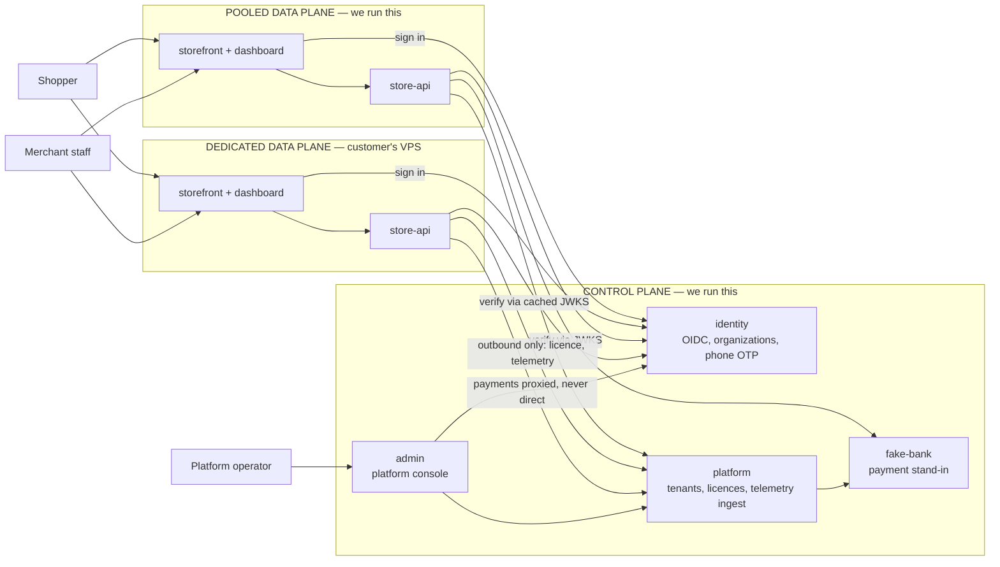

Two things the diagram is making a point of:

- **`dapi` never touches a control-plane database.** It sees HTTP endpoints only. That's `CO3`,
  and it's assertable in the Aspire application model.
- **The dedicated plane does not call `fake-bank` directly** — payments proxy through the control
  plane, because our payment credentials must never sit on a customer's server (`CE2`).

---

## 2. Service graph

Each deployable and the store it owns. Same colour of box on both planes means *the same image*.

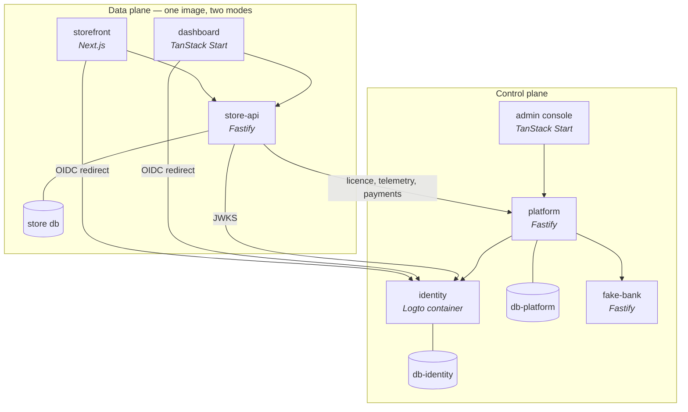

`DEPLOYMENT_MODE=pooled` gives that box N tenants in one database.
`DEPLOYMENT_MODE=dedicated` gives it exactly one. **No other difference** (`CC1`, `CC2`).

---

## 3. Tenancy tiers and routing

Three tiers, and the middle one is the one worth building early — it delivers most of what
merchants mean by "my own site" at a fraction of the cost of tier 3.

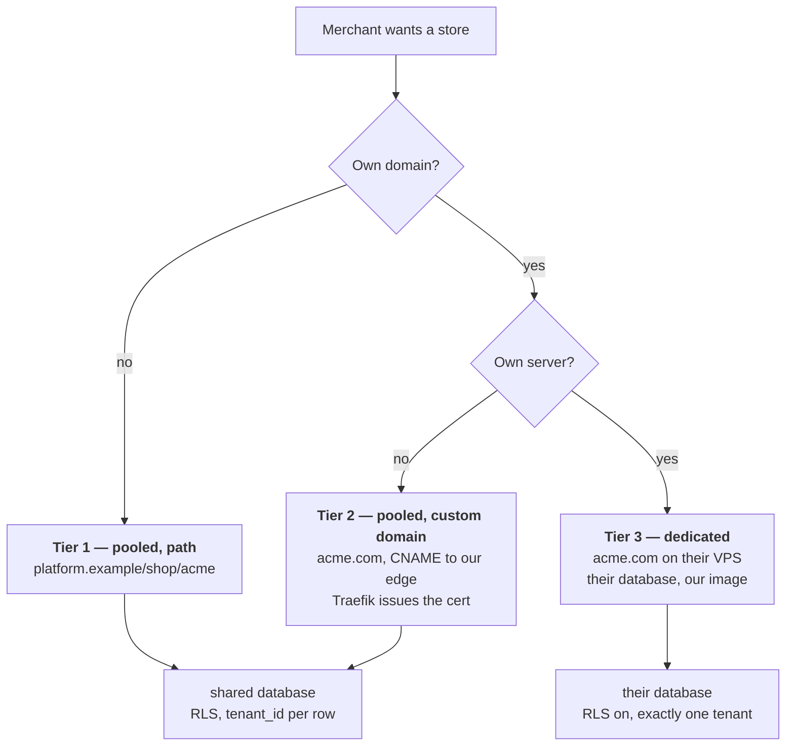

**Tier 2 is out of the POC** — it is tier 1 code with the tenant resolved from a hostname instead
of a path, so it adds certificate automation and proves no new architecture. What the POC *does*
build is the seam: tenant resolution takes a **request** and checks host before path, so tier 2
later means adding a `domains` table and pointing DNS, not touching every route.

Routing at request time:

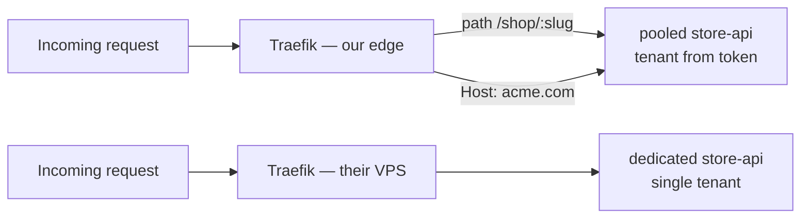

The host **selects branding**. The **token decides** what you can read (`BI1`). A token whose
tenant disagrees with the host is a 403, not a tenant switch.

---

## 4. Who owns which data

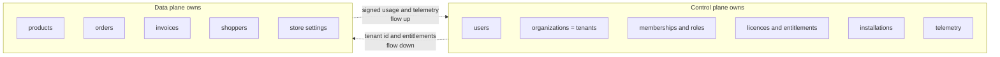

Note where **shoppers** sit: in the data plane, per tenant — *not* in the IdP (`CD3`). Merchant
staff are in the IdP; storefront customers are rows.

---

## 5. Sign-in and token flow

The part that makes a server we don't control able to trust a token we issued.

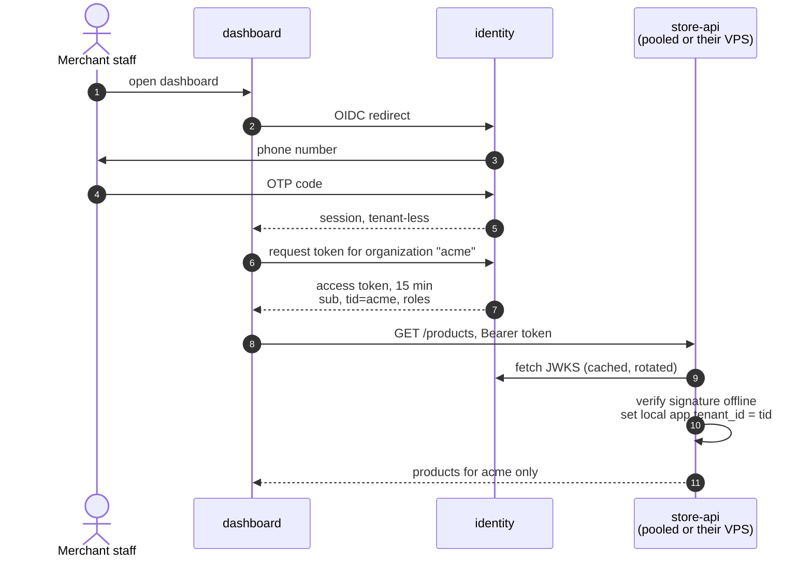

Steps 8–10 are the whole design: the data plane verifies **offline** against cached keys, then
hands the tenant to Postgres, where RLS — not application code — decides what the query can see
(`BE1`, `BE3`). Switching tenants means going back to step 6 for a new token (`BC1`).

---

## 6. Buy a store

The signup flow, with `fake-bank` standing in for a payment provider.

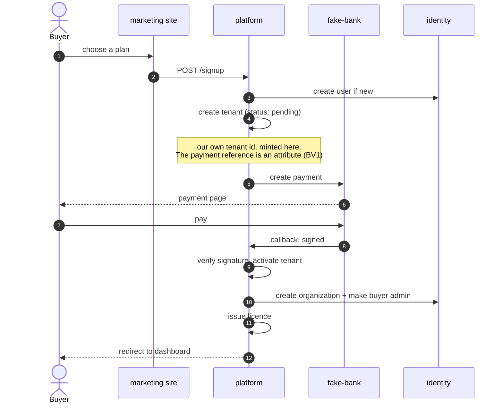

Two deliberate choices here:

- **Signup creates the tenant; payment activates it.** That's why trials, internal demo stores and
  manually-onboarded merchants exist without faking a bank callback.
- **`fake-bank` verifies our signature before answering**, so a break in our request hash shows up
  on a laptop instead of at a real bank later (`CR1`).

---

## 7. Provisioning a dedicated instance

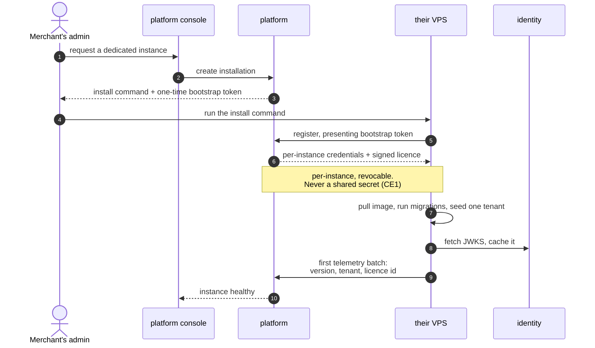

Every arrow is **outbound from the VPS** (`CE4`). Nothing reaches in — no SSH, no callback port,
no VPN.

---

## 8. What happens when the link breaks

The showcase demo: stop `platform` in the Aspire dashboard and watch the dedicated store keep
selling.

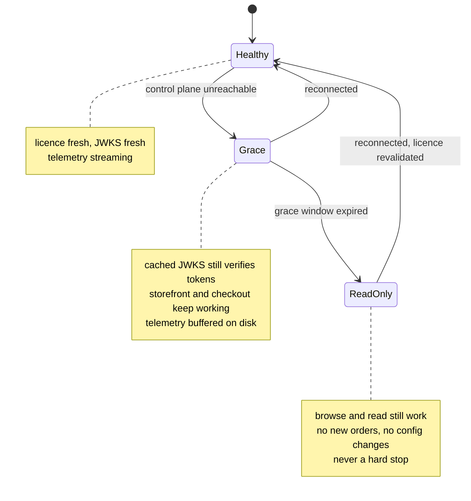

A merchant's shop going dark because our licence server had a bad afternoon is the thing that
would kill the tier, so the terminal state is degraded, never off (`CG1`, `CG2`).

---

## 9. Data model

Control plane above the line, data plane below it.

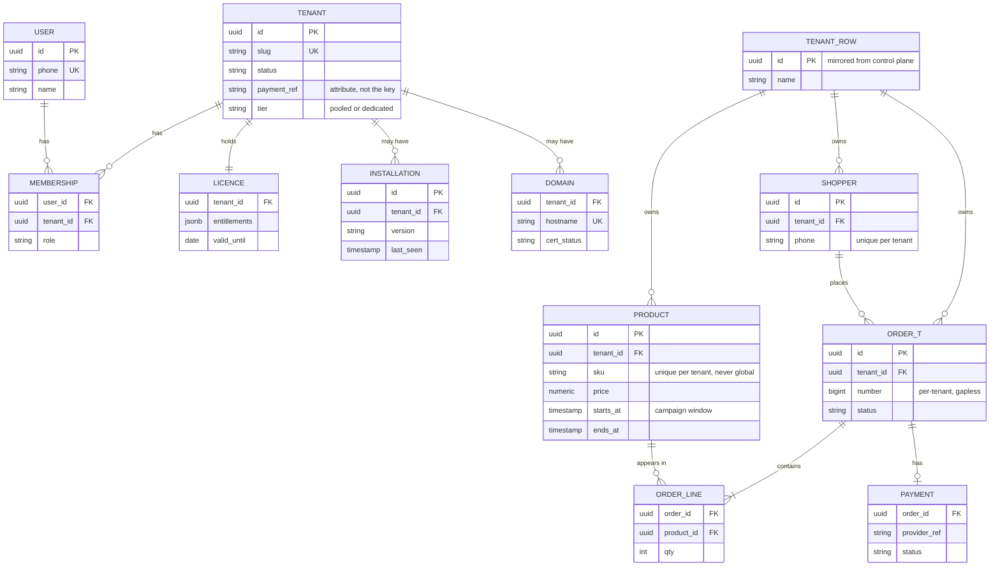

Every data-plane table carries `tenant_id` and an RLS policy — including in a dedicated install
where there is only ever one value in it (`CC2`). Uniqueness is always composite (`BG1`), and
order numbers come from a per-tenant counter, never a sequence (`BG2`).

---

## 10. What `aspire run` starts

One command brings up the control plane, a pooled store with two tenants, and a dedicated store
standing in for a customer's VPS.

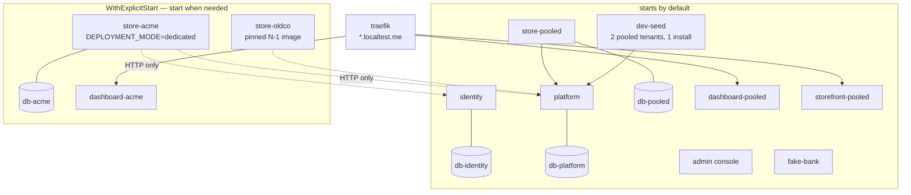

What that buys, beyond convenience:

| Demo | How |
|---|---|
| Tenant isolation is real | two pooled tenants seeded; the leak suite runs against them (`BL1`) |
| Same code, both modes | `store-pooled` and `store-acme` are the same app directory (`CC1`) |
| Offline behaviour | stop `platform` in the dashboard, watch `store-acme` degrade (§8) |
| Version skew | `store-oldco` runs the N-1 image against today's control plane (`CO2`) |
| Payment failure paths | `fake-bank` is told what to answer (`CR1`) |
| Unified telemetry | every resource, including the "remote" one, pushes OTLP to the Aspire dashboard |

Local hostnames use `*.localtest.me`, which resolves to 127.0.0.1 with no `/etc/hosts` editing:
`platform.localtest.me/shop/acme` (tier 1), `acme-store.localtest.me` (tier 2),
`acme.localtest.me` (tier 3).

---

## 11. POC scope

What the showcase needs to be convincing, and what it deliberately leaves out.

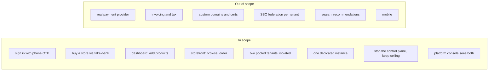

The demo that makes the architecture land is **i7**: kill the control plane on stage and show a
merchant's shop still taking orders on its own server, then bring it back and watch the buffered
telemetry arrive. Everything else is table stakes; that one is the argument.

---

*Companion to [`../README.md`](../README.md) and [`dos-and-donts.md`](./dos-and-donts.md).*
